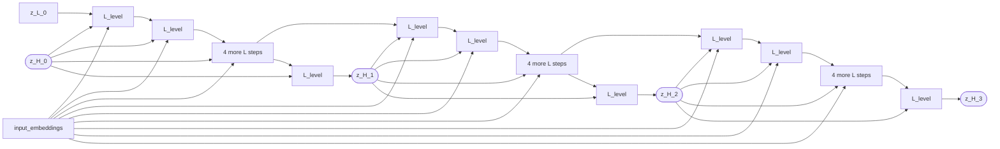
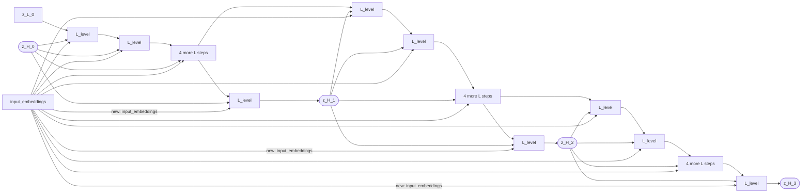

## Original

```mermaid
flowchart LR

E[input_embeddings]

ZL0[z_L_0]

CELL1[L_level]
CELL2[L_level]
DOTS1[4 more L steps]
CELL3[L_level]
CELL4[L_level]
DOTS2[4 more L steps]
CELL5[L_level]
CELL6[L_level]
DOTS3[4 more L steps]

ZH0([z_H_0])
ZH1([z_H_1])
ZH2([z_H_2])
ZH3([z_H_3])

CELLH1[L_level]
CELLH2[L_level]
CELLH3[L_level]

ZL0 --> CELL1 --> CELL2 --> DOTS1 --> CELL3 --> CELL4 --> DOTS2 --> CELL5 --> CELL6 --> DOTS3

ZH0 --> CELL1
ZH0 --> CELL2
ZH0 --> DOTS1

E --> CELL1
E --> CELL2
E --> DOTS1

DOTS1 --> CELLH1
ZH0 --> CELLH1
CELLH1 --> ZH1

ZH1 --> CELL3
ZH1 --> CELL4
ZH1 --> DOTS2

E --> CELL3
E --> CELL4
E --> DOTS2

DOTS2 --> CELLH2
ZH1 --> CELLH2
CELLH2 --> ZH2

ZH2 --> CELL5
ZH2 --> CELL6
ZH2 --> DOTS3

E --> CELL5
E --> CELL6
E --> DOTS3

DOTS3 --> CELLH3
ZH2 --> CELLH3
CELLH3 --> ZH3
```

## Modified

```mermaid
flowchart LR

E[input_embeddings]

ZL0[z_L_0]

CELL1[L_level]
CELL2[L_level]
DOTS1[4 more L steps]
CELL3[L_level]
CELL4[L_level]
DOTS2[4 more L steps]
CELL5[L_level]
CELL6[L_level]
DOTS3[4 more L steps]

ZH0([z_H_0])
ZH1([z_H_1])
ZH2([z_H_2])
ZH3([z_H_3])

CELLH1[L_level]
CELLH2[L_level]
CELLH3[L_level]

ZL0 --> CELL1 --> CELL2 --> DOTS1 --> CELL3 --> CELL4 --> DOTS2 --> CELL5 --> CELL6 --> DOTS3

ZH0 --> CELL1
ZH0 --> CELL2
ZH0 --> DOTS1

E --> CELL1
E --> CELL2
E --> DOTS1

DOTS1 --> CELLH1
ZH0 --> CELLH1
CELLH1 --> ZH1

ZH1 --> CELL3
ZH1 --> CELL4
ZH1 --> DOTS2

E --> CELL3
E --> CELL4
E --> DOTS2

DOTS2 --> CELLH2
ZH1 --> CELLH2
CELLH2 --> ZH2

ZH2 --> CELL5
ZH2 --> CELL6
ZH2 --> DOTS3

E --> CELL5
E --> CELL6
E --> DOTS3

DOTS3 --> CELLH3
ZH2 --> CELLH3
CELLH3 --> ZH3

%% NEW ARROWS IN MODIFIED CODE (LABELED)
E -- "new: input_embeddings" --> CELLH1
E -- "new: input_embeddings" --> CELLH2
E -- "new: input_embeddings" --> CELLH3

```